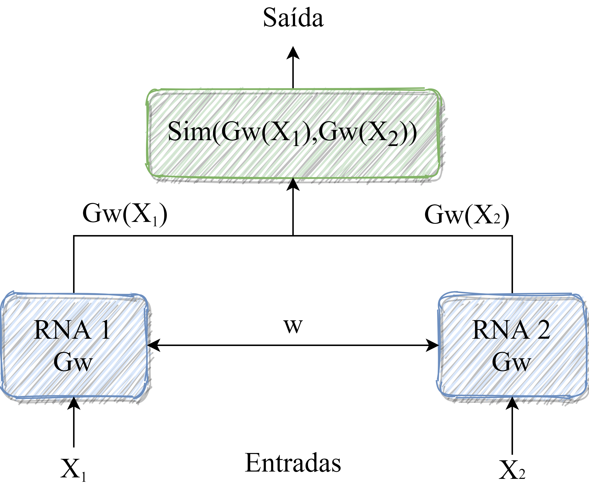

# Trabalho de Conclusão de Curso - Similaridades de Estilos Literários Baseadas em Aprendizado Profundo

Trabalho Conclusão referente ao curso de graduação de Bacharelado de Sistema de Informação do IFES - Serra.

### Informações gerais
- **Autor**: Harã Heique
- **Orientador**: Fidelis Castro
- **Linguagem de programação**: Python (versão 3.6.8+)
- **Ambiente de desenvolvimento**: Visual Studio Code (versão 1.35.1+) e PyCharm (versão 2019.2.2+)

As **Redes Neurais** são representados como modelos computacionais contendo nós interconectados que funcionam 
semelhante aos neurônios de um cérebro humano, sendo estes capazes, com o auxílio do aprendizado de máquina, no 
reconhecimento de padrões, correlações, agrupamentos e classificação entre dados através de algoritmos.

Como é mencionado pela [*SAS*](https://www.sas.com/en_us/insights.html), as Redes Neurais são comumente 
utilizadas para resolver problemas complexos do dia a dia, consequentemente auxiliando em melhores tomadas de decisões, 
onde dentre as suas aplicações encontradas no mercado são:

* Otimização de Logística em sistemas de transporte;
* Previsão de demanda de energia e carga elétrica;
* Reconhecimento de voz;
* Detecção de fraudes na área financeira, literária e afins;
* Entre outras.

Baseado nisto este trabalho de conclusão de curso tem como intuito analisar a performance de uma rede neural siamesa 
para classificação de textos literários usando medidas de similaridade.

### Rede Neural Siamesa

As **Redes Neurais Siamesas** são classificadas como redes computacionais que possuem como característica duas ou mais sub-redes idênticas. São 
comumente utilizadas em tarefas de similaridades entre diferentes instâncias, e aplicadas em classificações e 
verificações de autenticidade, tal como é um dos pontos abordados na monografia do trabalho.

A figura abaixo mostra uma arquitetura padrão de uma Rede Siamesa, em que as duas subredes são ligadas por camadas
compartilhando pesos entre si. Tanto no treinamento quanto nos testes de predição, a rede é alimentada por pares de 
entrada no intuito de aproximar pares de uma mesma classe e distanciar pares de classes diferentes. Esta métrica de
distanciamento é definida por uma medida de similaridade, que comumente geram valores de saída, como no exemplo do
trabalho que são valores de 0 a 1, em que quanto mais próximo de 1 maior é a similaridade entre os pares. Caso contrário
mais distante são eles, implicando que tendem a serem assimilares.  

<p align="center">
    
</p>

Já na figura abaixo demonstra o fluxo de funcionamento principal da Rede Neural Siamesa utilizada neste trabalho de conclusão. Note que ela contém diversas etapas, onde na primeira é realizada a **obtenção dos dados**, que neste caso são os textos literários de autores da literatura inglesa. Logo depois é realizado a **estruturação dos dados**, os quais são selecionadas frases das obras literárias e transformados em colunas em arquivos do formato *CSV*. Após isto é realizado o **pré-processamento dos dados**, retirando palavras indesejadas (sem influência) e criação dos vetores de indíces de cada frase lida do arquivo *CSV*. Dado isto na etapa seguinte é realizado o processo de **normalização/preparação dos dados** de entrada da rede neural, onde são basicamente criados e separados os dados de *treinamento* e *validação* para o lado esquerdo e direito da rede. Já na quinta etapa é realizada a entrada dos dados e seu **processamento** nas camadas escondidas (hidden) do modelo de uma rede neural *LSTM (Long Short Term Memory)* ou *CNN (Convolutional Neural Network)*, ambas previamente criadas e modeladas, sendo esta uma etapa fundamental no treinamento e predição. Na sexta etapa é realizada **chamada da medida/função de similaridade**, o qual pode ser a medida de *Manhattan*, *Cosseno* ou *Euclidiana*, nas saídas da rede neural, sendo ela responsável pelo processo de merge das duas subredes utilizadas. Por fim na etapa de **resultado** é apresentado um valor entre 0 e 1 (intervalo fechado) que determina o índice de similaridade entre os diferentes pares.

<p align="center">
    
</p>

### Descrição geral
A estrutura da aplicação está definida da seguinte maneira:

```
TCC-rede-neural-siamesa
    |_ docs
       |_ *arquivos de documentação*
    |_ src
       |_ core
          |_ helper.py
          |_ prediction.py 
          |_ training.py
       |_ data
          |_ prediction
             |_ *arquivos de entrada de predição*
          |_ training
             |_ *arquivos de entrada de treinamento*
          |_ GoogleNews-vectors-negative300.bin.gz
          |_ *arquivos de modelos da rede neural*.h5
       |_ enums
          |_ Stage.py
       |_ models
          |_ ManhattanDistance.py
       |_ results
          |_ *arquivos de resultados e análises*
       |_ user_interface
          |_ cli_input.py
          |_ cli_output.py
    |_ main.py
    |_ README.md
    |_ dependencies.sh
```

#### Descrição geral dos arquivos
Descrição geral dos principais arquivos contidos nesta aplicação:

Arquivo|Path|Descrição
---|---|---
**ManhattanDistance.py**|src/models/ManhattanDistance.py|Classe que representa a medida/função de similaridade da distância de Manhattan. São necessárias pois servem para realizar o processo de merge da saída das subredes siamesas.
**Stage.py**|src/enums/Stage.py|É a classe enumerada em que seus valores determina qual dos estágios o usuário deseja executar da rede no processo de interação com a interface. Os valores são: NONE(0), TRAINING(1) e PREDICTION(2), os quais suas nomenclaturas são auto-explicativas.
**helper.py**|src/core/helper.py|É o módulo responsável por conter funções auxiliares para os módulos principais da aplicação: *prediction.py* e *traning.py*.
**training.py**|src/core/prediction.py|É o módulo que contém funções para realização de todo o processo de treinamento da rede neural, ou seja, pré-processamento dos dados, criação da matrix incorporada, normalização/preparação dos dados, criação do modelo com suas camadas (criação da rede neural siamesa com uma arquitetura e medida de similaridade previamente escolhidas), execução do treinamento e seus resultados.
**prediction.py**|src/core/training.py|Este módulo contém funções para realização do processo de predição dado um conjunto de dados de entrada na rede previamente treinada, determinando assim o indíce de similiridade existente entre pares de entredas distintos.
**cli_input.py**|src/user_interface/cli_input.py|É um módulo que interage com o usuário fazendo o papel de receber, tratar e validar as entradas de informações requeridas pelo usuário.
**cli_output.py**|src/user_interface/cli_output.py|É um módulo que também interage com o usuário, mas com o papel de mostrar os dados e informações de saída, tais como mensagens, limpeza do prompt, quebras de linhas para melhor formatação e afins.
**main.py**|src/main.py|É o módulo principal (bootstrap) da aplicação, ou seja, contém a execução princpal e coordena as chamadas de todos os módulos e classes pertencentes.
**GoogleNews-vectors-negative300.bin.gz**|src/data/GoogleNews-vectors-negative300.bin.gz|Este arquivo é carregado runtime na aplicação e é basicamente responsável por realizar o word embedding, ou seja, define a incoporação word2vec corresponde de cada palavra das frases de entrada para serem encapsuladas na matriz de incorporação, sendo esta importante na etapa de criação do modelo e treinamento da rede neural siamesa.
**arquivos de entrada de predição**|src/data/arquivos de entrada de predição|São os arquivos, em geral no formato *.csv*, contendo somente duas colunas, sendo elas *phrase1* e *phrase2* (ambas frases extraídas de obras literárias de um autor da literatura inglesa).
**arquivos de entrada de treinamento**|src/data/arquivos de entrada de treinamento|São os arquivos, em geral no formato *.csv*, contendo como as principais colunas *phrase1*, *phrase2* (ambas frases extraídas de obras literárias de um autor) e *label* (nome do autor das frases).
**arquivos de modelos da rede neural.h5**.|src/data/arquivos de modelos da rede neural.h5|Contém arrays multidimensionais de dados dos modelos da rede neural siamesa. Este arquivo é gerado sempre que o modelo da rede neural é salvo. Posteriormente na etapa de predição o modelo da rede salva é carregado e utilizado.


### Como executar?
Para executar a aplicação no ambiente Linux, o qual é o principal utilizado, basta seguir os seguintes passos:

1. Primeiramente é necessário conter o interpretador do Python 3. Para baixar e instalar siga este 
[link](https://www.python.org/downloads/), onde pode ser encontrado a última versão estável;

2. O ideal é que antes de executar a **etapa 3** é recomendável realizar a instalação das dependências em um ambiente 
virtual do Python, pois ele empacota todas as dependências que um projeto precisa e armazena em um 
diretório, isolando-o do SO base. A seguir um [link](https://pythonacademy.com.br/blog/python-e-virtualenv-como-programar-em-ambientes-virtuais) 
explicando em detalhes o que são e o passo a passo de como instalar e utilizar;

3. Abra o terminal bash dentro do ambiente virtual e execute o seguinte comando para instalar as dependências da 
aplicação:

        $ sh dependencies.sh

4. Após instalar as dependências ao projeto é necessário baixar o word2vec no [link](https://drive.google.com/file/d/0B7XkCwpI5KDYNlNUTTlSS21pQmM/edit) 
e colocá-lo no diretório **/src/data**;

5. Feito isto basta abrir o CLI (Command Line Interface) no diretório **/src** da aplicação e 
executar o seguinte comando para inicializar a aplicação:

        $ python3 main.py

6. Por fim basta interagir com a interface de linha de comando escolhendo as opções fornecidas pela aplicação, sendo as
principais de **treinamento** e **predição**.


### Informações adicionais
Todo o código fonte está hospedado no [GitHub](https://github.com/HaraHeique/TCC-Rede-Neural-Siamesa).
